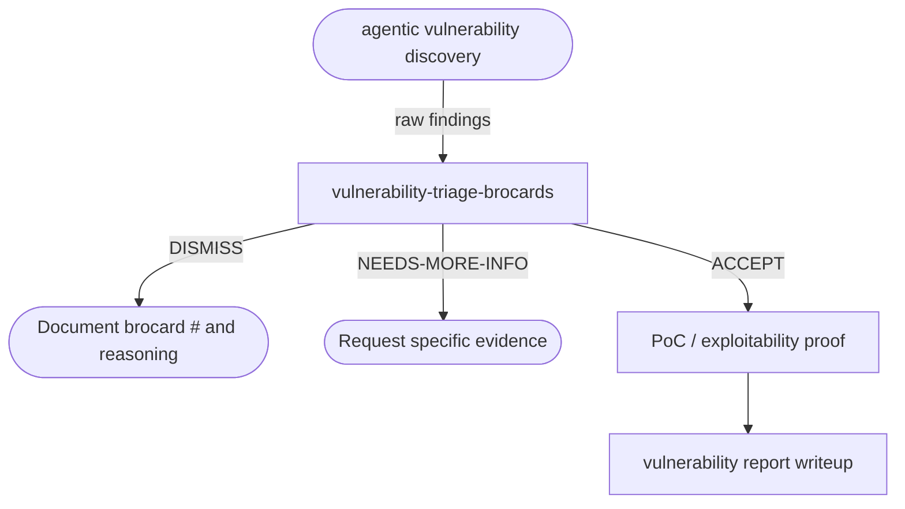

# Vulnerability Triage Brocards

Systematically evaluate incoming vulnerability reports against 7 principled
criteria before committing resources to deeper analysis. Each brocard is a
falsifiable test: if a report fails any brocard, document the reason and
dismiss or request clarification. If a report survives all 7, escalate it.

The 7 brocards are adapted from William Woodruff's
["Brocards for vulnerability triage"](https://blog.yossarian.net/2026/04/11/Brocards-for-vulnerability-triage)
(2026).

## When to Use

- Filtering findings from agentic vulnerability discovery pipelines
  before human review -- the primary use case; most automated runs
  produce findings that fail one or more brocards and can be dismissed
  without auditor time
- Triaging findings during a ToB audit to decide which warrant
  escalation to PoC development
- Evaluating third-party CVEs or advisories against a codebase under
  active audit to decide if they affect engagement scope
- Reviewing bug bounty submissions or external vulnerability reports
  for ToB open-source projects
- Providing structured, defensible justification when recommending a
  client dismiss or deprioritize a reported CVE

## When NOT to Use

- **Hunting for new bugs during an audit** -- use other skills
- **Proving exploitability of a confirmed finding** -- use a
  dedicated PoC/exploitability skill
- **Triaging fuzzer crashes in C/C++** -- use a dedicated crash
  triage skill

## Pipeline Position

This skill is the quality gate between automated discovery and human
review. Findings that survive triage proceed to PoC development and
formal writeup.



## Triage Workflow

For each incoming vulnerability report, evaluate it against all 7 brocards
sequentially. By default, stop at the first DISMISS verdict and report it.
If the user requests a full evaluation, continue through all 7 brocards
regardless of intermediate failures. For each brocard, record one of three
verdicts:

- **PASS** -- the report survives this test
- **DISMISS** -- the report fails this test; document the reason
- **NEEDS-MORE-INFO** -- insufficient evidence to evaluate; specify what is
  missing

### Brocard 1: No Vulnerability Without a Threat Model

Dismiss any report that lacks a coherent threat model. The report must
articulate: (a) who the attacker is, (b) what capability the attacker has,
(c) how the attacker exploits the behavior, and (d) what harm results.

Reports that describe a code behavior without connecting it to attacker-
reachable harm fail this brocard.

**Quick test:** Can the report answer "an attacker with [capability] can
[action] to achieve [impact]"? If not, dismiss or request clarification.

### Brocard 2: No Exploit from the Heavens

Dismiss any report where the attacker capabilities required to trigger the
vulnerability equal or exceed the impact of the vulnerability itself. If the
attacker must already possess the power the exploit would grant, the
vulnerability is redundant.

**Quick test:** Does triggering the exploit require capabilities that already
subsume its impact? If yes, dismiss.

### Brocard 3: No Vulnerability Outside of Usage

Dismiss any report describing behavior that is theoretically possible but
does not occur in actual software usage. Check whether the vulnerable code
path is reachable in practice.

**Quick test:** Is the vulnerable code path exercised by any real caller?
If not, dismiss. If the report targets a library, ask if we should check
downstream usage.

### Brocard 4: No Vulnerability from Standard Behavior

Dismiss any report where the behavior results from correct implementation of
a specification. The vulnerability, if any, exists in the standard -- not the
implementation.

**Nuance:** If an implementation voluntarily adopts a stricter posture than
the standard requires, and that strictness fails, the implementation *is*
vulnerable even though the standard permits the behavior.

**Quick test:** Does the specification require or permit this behavior? If
yes, the report targets the standard, not the code.

### Brocard 5: No Vulnerability from Documented Behavior

Dismiss any report describing behavior that is explicitly documented,
especially when the documentation includes security implications or usage
caveats.

**Nuance:** Downstream usage that violates documented guidelines may
constitute a valid vulnerability in the *downstream* project, not the
documented component.

**Quick test:** Does the project's documentation describe this behavior and
warn against misuse? If yes, dismiss the report against the project itself.

### Brocard 6: No Cure Worse Than the Disease

Dismiss any report whose remediation would cause more harm than the
vulnerability itself. Evaluate: (a) severity of the vulnerability in
practice, (b) cost and disruption of the proposed fix, (c) blast radius of
the remediation (dependency graph, ecosystem impact).

**Quick test:** Would fixing this cause more disruption than the
vulnerability itself? If yes, dismiss or downgrade severity.

### Brocard 7: The Report Is Neither Necessary nor Sufficient

A CVE identifier or formal report does not prove a vulnerability exists.
Conversely, absence of a report does not prove safety. Evaluate the
technical merits independently of report metadata.

**Quick test:** Strip the CVE number and CVSS score. Does the technical
description alone justify action? Judge on evidence, not authority.

## Output Format

After evaluating all 7 brocards, produce a structured triage summary:

```
## Triage Summary: [Report ID or Title]

| # | Brocard | Verdict | Rationale |
|---|---------|---------|-----------|
| 1 | Threat Model | PASS/DISMISS/NEEDS-MORE-INFO | ... |
| 2 | Exploit from the Heavens | PASS/DISMISS/NEEDS-MORE-INFO | ... |
| 3 | Outside of Usage | PASS/DISMISS/NEEDS-MORE-INFO | ... |
| 4 | Standard Behavior | PASS/DISMISS/NEEDS-MORE-INFO | ... |
| 5 | Documented Behavior | PASS/DISMISS/NEEDS-MORE-INFO | ... |
| 6 | Cure Worse Than Disease | PASS/DISMISS/NEEDS-MORE-INFO | ... |
| 7 | Report Sufficiency | PASS/DISMISS/NEEDS-MORE-INFO | ... |

**Overall Verdict:** ACCEPT / DISMISS / NEEDS-MORE-INFO
**Reasoning:** [1-3 sentence justification]
**Next Step:** [escalate to PoC development / request info / close]
```

## Rationalizations to Reject

Guard against these reasoning failures in both directions:

### Wrongly Dismissing Valid Findings

- "It's only reachable in debug mode" -- verify debug mode is truly
  never enabled in production; many clients ship with debug flags on
- "The attacker would need local access" -- local access is a realistic
  threat model for many deployments, especially containerized services
- "Nobody uses that API" -- confirm with actual usage data, not
  assumptions; check client's integration tests and deployment configs
- "The spec allows it" -- check whether the implementation claims
  stricter behavior than the spec requires

### Wrongly Accepting Invalid Findings

- "It has a CVE, so it must be real" -- Brocard 7 exists for this reason
- "The CVSS score is high" -- CVSS is a formula, not a verdict
- "Better safe than sorry" -- Brocard 6 requires evaluating fix cost
- "We can't prove it's NOT exploitable" -- the burden of proof is on the
  reporter to demonstrate a threat model (Brocard 1)
- "Other projects patched it" -- other projects may have different usage
  patterns (Brocard 3)
- "We should include it to pad the report" -- ToB reports reflect
  technical reality, not finding count targets; a dismissed report with
  documented reasoning is more valuable than a false positive in a
  final deliverable

## Detailed References

For expanded explanations, examples, and edge cases for each brocard, consult
[`references/brocards-detail.md`](references/brocards-detail.md).
